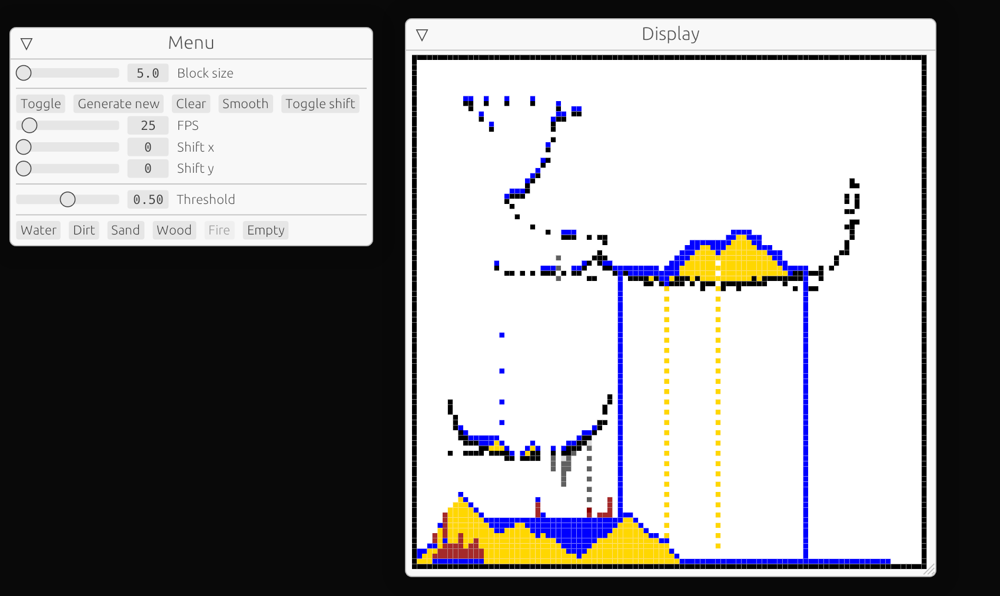

# Rust cellular automata

[DEMO](https://is.simulation.skippy-ai.com)
- Cave generation
- Simulation of various materials
  - Water
  - Sand
  - Wood
  - Fire

## Possible improvements

- use Bevy game engine for rendering
- use shaders
- use GPU rendering

### Info

- Web performance is worse than native
- This was a small school project for an exercise in a class
- Was built in **less than a week**
- Still new to rust

### New things I learned

- Difference between immediate mode and retained mode UI
- Egui and how to run it in web
- A little bit about rust folder structure

